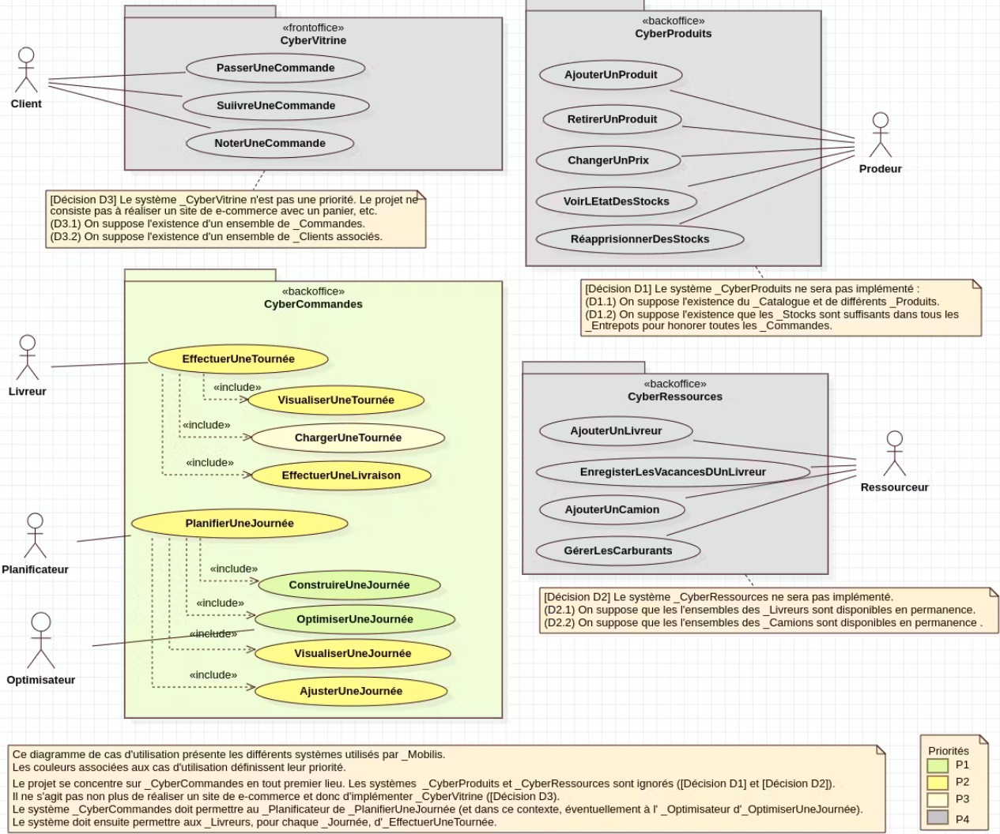
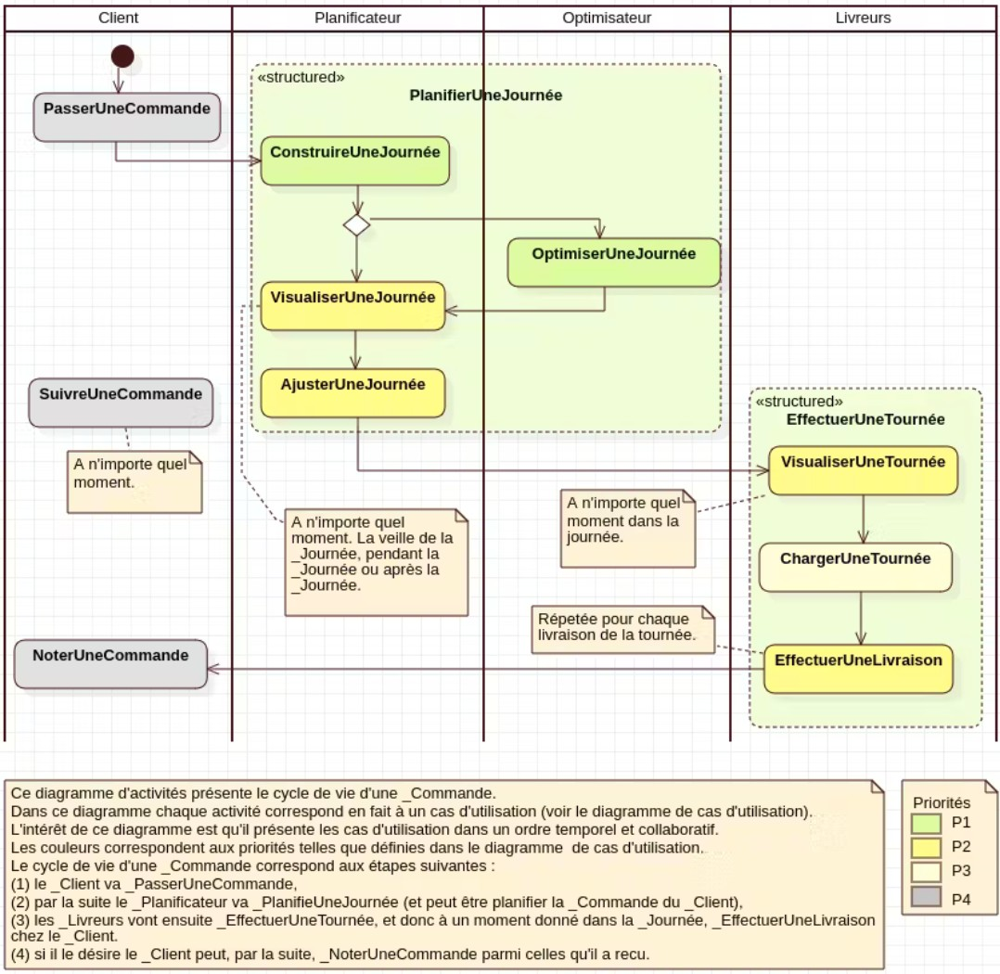
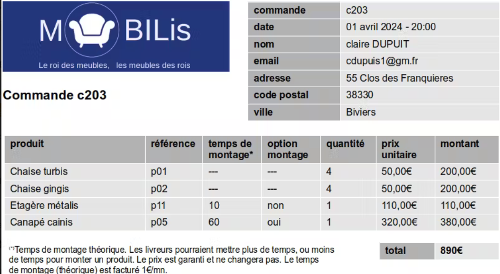
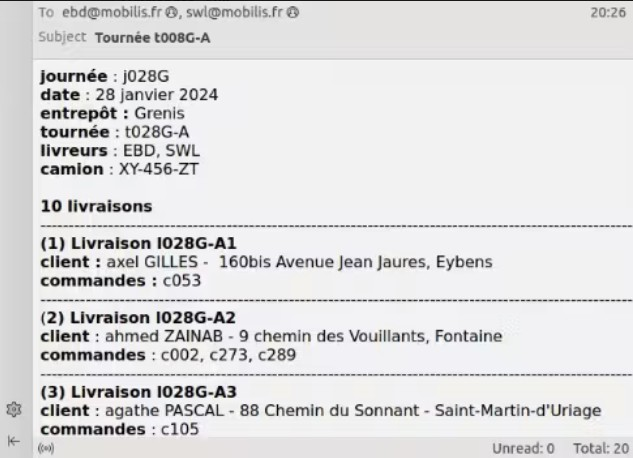

#  CyberCommandes

La société Mobilis commercialise des _Produits d’aménagements (essentiellement des meubles mais aussi des objets de décoration). Il s'agit de développer le système CyberCommandes pour faciliter les gestion des commandes. Ce document décrit un modèle de cas d'utilisation pour ce système. Un diagramme de cas d'utilisation est fourni ainsi qu'un diagramme d'activités. Les cas d'utilisation sont ensuite détaillées les uns après les autres.

---------------------------------------------------------------------------

# Modèle de cas d'utilisation

Cette section décrit le modèle de cas d’utilisation. Alors que le diagramme CasDUtilisation_VisionGlobale donne une vision graphique, cette section présente le modèle de cas d’utilisation sous forme structurée et décrit chaque élément de manière plus détaillée. Ci-dessus le diagramme d’activités Activités_CycleDeVieDUneCommande est également montré car les activités présentées correspondent directement aux principaux cas d’utilisation.

## Diagramme de cas d'utilisation

**CasDUtilisation_VisionGlobale**

Ce diagramme de cas d'utilisation présente les différents systèmes utilisés par _Mobilis. Le projet se concentre sur _CyberCommandes. Les couleurs associées aux cas d'utilisation définissent leur priorité. Ce diagramme est a priori complet.

## Diagramme d'activités

**Activités_CycleDeVieDUneCommande**

Ce diagramme d'activités présente le cycle de vie d'une _Commande. 
Dans ce diagramme chaque activité correspond en fait à un cas d'utilisation (voir le diagramme de cas d'utilisation). 
L'intérêt de ce diagramme est qu'il présente les cas d'utilisation dans un ordre temporel et collaboratif.

Ce diagramme est a priori complet. 

## Exemple de commande - c203

## Exemple de tournée - t008G_A

Avant l’implémentation de _CyberCommandes, le _Planificateur construisait “à la main” les _Journées et prévenait par mél les _Livreurs des tournées qu’ils devaient effectuer. L’email ci-dessus présente la _Tournée j028G-A devant être assurée par deux _Livreurs : EBD et SWL. 

---------------------------------------------------------------------------

# Cas d'utilisation

Les cas d'utilisations sont décrits ci-dessous. Utiliser la recherche de votre navigateur pour trouver un cas d'utilisation particulier.

## cas d'utilisation PasserUneCommande

**acteurs** : Client

**système** : CyberVitrine

### résumé

Le _Client ajoute des _Produits les uns après les autres avec leur quantité et les _OptionMontages. _CyberVitrine affiche le _Montant à payer. Le _Client valide et paye.  

### références

* Voir les diagrammes CasDUtilisation_VisionGlobale et Activités_CycleDeVieDUneCommande. 

### scénario nominal

1. Le _Client sélectionne un _Produit dans le _Catalogue. 

2. Le _Client sélectionne une quantité.

3. Le _Client choisi ou non l’ _OptionMontage si celle-ci est disponible pour le _Produit.

4. _CyberVitrine affiche le montant. 

5. Le _Client confirme.

6. _CyberVitrine ajoute une _Ligne à la _Commande.

7. Le _Client recommence à l’étape (1) tant qu’il veux des _Produits.

8. _CyberVitrine affiche le montant total.

9. Le _Client paie le montant total.

10. _CyberVitrine met la _Commande dans l’état _CommandeOuverte.  

## cas d'utilisation SuivreUneCommande

**acteurs** : Client

**système** : CyberVitrine

### résumé

Pour les _CommandeEnLivraison, _CyberVitrine affiche sur une carte la position du _Camion ainsi que le nombre de _Livraisons à effectuer avant la _Livraison du _Client.  

### références

* Voir les diagrammes CasDUtilisation_VisionGlobale et Activités_CycleDeVieDUneCommande. 

### préconditions

* Le _Client a déjà passé des _Commandes. 

### scénario nominal

1. _CyberVitrine affiche la liste des _Commande groupées par états.

2. Le _Client sélectionne une _Commande.

3. S’il s’agit d’une _CommandeEnLivraison _CyberCommandes affiche la position du _Camion de livraison sur une carte ainsi que le nombre de _Livraisons devant avoir lieu avant la _Livraison du _Client.  

## cas d'utilisation NoterUneCommande

**acteurs** : Client

**système** : CyberVitrine

### résumé

Le _Client ajoute une note et un commentaire à une _CommandeLivrée. 

### références

* Voir les diagrammes CasDUtilisation_VisionGlobale et Activités_CycleDeVieDUneCommande. 

### préconditions

* Le _Client a une ou plusieurs _CommandeLivrée. 

### scénario nominal

1. Le _Client sélectionne une _CommandeLivrée parmi ses _Commandes.

2. Le _Client ajoute une note à la _CommandeLivrée ainsi qu’un commentaire.

3. _CyberVitrine met la _Commande dans l’état _CommandeNotée . 

## cas d'utilisation EffectuerUneTournée

**acteurs** : Livreur

**système** : CyberCommandes

### structure

Cas d’utilisation composé.

### références

* Voir les diagrammes CasDUtilisation_VisionGlobale et Activités_CycleDeVieDUneCommande. 

### résumé

Le _Livreur visualise régulièrement l’état de sa _Tournée (VisualiserUneTournée), il va ChargerUneTournée et finalement va EffectuerUneLivraison.  

### scénario nominal 

1. Le _Livreur va VisualiserUneTournée.

2. Le _Livreur va  ChargerUneTournée.

3. Le _Livreur va EffectuerUneLivraison. 

## cas d'utilisation VisualiserUneTournée

**acteurs** : Livreur

**système** : CyberCommandes

### structure

Sous-cas d’utilisation de EffectuerUneTournée. 

### références

* Voir les diagrammes CasDUtilisation_VisionGlobale et Activités_CycleDeVieDUneCommande. 

### résumé

_CyberCommandes affiche toutes les _Livraisons restant à effectuer sur une carte  ainsi que les différentes informations relatives à la _Tournée (_Livreurs , _Camion, etc.). Le _Livreur peut “zoomer” sur la prochaine _Livraison à réaliser.

### préconditions

* Le  _Livreur a été affecté à une _Tournée.

### scénario nominal

1. Le (ou les) _Livreur lance _CyberCommandes sur son téléphone portable.

2. _CyberCommandes affiche la date du jour ainsi que les informations associées à la _Tournée à laquelle le _Livreur a été affecté. Les informations incluent : (a) le nom de l’ _Entrepôt dans lequel les _Commandes doivent être retirées, (b) l’immatriculation du _Camion associé à la _Tournée, (c) le _Trigramme et le téléphone des _Livreurs associés à la _Tournée, (d) le nom du _Conducteur du _Camion, (e) l’ensemble ordonné des _Livraisons à réaliser. Les _Livraisons sont affichées sur une carte.

3. Le _Livreur peut “zoomer” sur la prochaine _Livraison a effectuer.        

## cas d'utilisation ChargerUneTournée

**acteurs** : Livreur

**système** : CyberCommandes

### structure

Sous-cas d’utilisation de EffectuerUneTournée. 

### références

Voir les diagrammes CasDUtilisation_VisionGlobale et Activités_CycleDeVieDUneCommande. 

### résumé

Le (ou les) _Livreur vont retirer de l’ _Entrepôt tous les _Exemplaires correspondant à tous les _Produits à livrer (par exemple toutes les chaises p03 puis tous les vases p17). _CyberCommandes montre ensuite comment charger le _Camion en regroupant les _Exemplaires par _Livraison. Voir l’opération de _Chargement. Le _Livreur charge le _Camion en mettant au fond du _Camion les _Livraisons a effectuer en dernier.  

### préconditions

* Le  _Livreur est à l’ _Entrepôt associé à une _Tournée.

### scénario nominal

1. Le (ou les) _Livreur lance _CyberCommandes sur son téléphone portable.

2. _CyberCommandes change l’état de toutes les _Livraisons associées à la _Tournée à _LivraisonEnCours. 

3. _CyberCommandes affiche, pour l’ensemble des _Commandes,  la liste agrégée de tous les _Produits à retirer.

4. Le _Livreur sélectionne un _Produit.

5. _CyberCommandes affiche la quantité cumulée  d’ _Exemplaires à retirer (toutes _Commandes confondues).

6. Le _Livreur va chercher les _Exemplaires dans l’ _Entrepôt et les dispose dans la zone de livraison, juste avant le _Camion. Le _Livreur recommence à l’étape 4 jusqu’à ce que les _Exemplaires de tous les _Produits soient retirés.

7. Une fois les _Exemplaires retirés, avant de charger le _Camion le _Livreur demande l’affichage des différentes _Livraisons pour organiser le chargement du _Camion en fonction des _Livraisons à effectuer.

8. _CyberCommandes affiche la liste des _Livraisons en commençant par la dernière, de sorte que les _Livreurs puissent mettre les _Exemplaires  à livrer en dernier au fond du _Camion.

9. Le _Livreur sélectionne le premier élément de la liste.

10. _CyberCommandes affiche la _Livraison avec la liste des _Commandes, et pour chaque _Commande la liste des _Exemplaires à charger.

11. Le _Livreur charge dans le _Camion les _Exemplaires correspondant aux _Commandes affichées par _CyberCommandes.

12. Si il reste des _Livraisons à charger, le _Livreur recommence à l’étape 9.    

## cas d'utilisation EffectuerUneLivraison

**acteurs** : Livreur

**système** : CyberCommandes

### structure

Sous-cas d’utilisation de EffectuerUneTournée. 

### références

Voir les diagrammes CasDUtilisation_VisionGlobale et Activités_CycleDeVieDUneCommande. 

### résumé

Arrivés chez un _Client les _Livreurs déchargent le _Camion (_Déchargement). Ils donnent tous les _Exemplaires au _Client et montent éventuellement les _Exemplaires à monter (_Montage).   

### préconditions

* Le  _Livreur a chargé le _Camion.

* Le _Livreur est arrivé chez un _Client.

### scénario nominal

1. Le _Livreur lance _CyberCommandes sur son téléphone portable.

2. Le _Livreur sélectionne la _Livraison qu’il s’apprête à effectuer.

3. _CyberCommandes affiche la liste  des _Exemplaires à décharger.

4. Les _Livreurs déchargent chaque _Exemplaire et les donnent au _Client.

5. _CyberCommandes affiche la liste des _Exemplaires pour _Montage. 

6. Les _Livreurs montent les _Exemplaire à monter. 

7. _CyberCommandes change l’état des _Commandes en _CommandeLivrées et enregistre l’ _HeureDeLivraisonEffective et la _DateDeLivraisonEffective.

## cas d'utilisation PlanifierUneJournée

**acteurs** : Planificateur

**système** : CyberCommandes

### structure

Cas d’utilisation composé. En plus du _Planificateur, ce cas d’utilisation peut optionnellement impliquer la collaboration de l’ _Optimiseur. 

### références

* Voir les diagrammes CasDUtilisation_VisionGlobale et Activités_CycleDeVieDUneCommande. 

### résumé

Le _Planificateur d’un _Entrepôt va ConstuireUneJournée pour cet _Entrepôt, ’est à dire planifier différentes éléments à l’intérieur de cette _Journée. Ces éléments sont éventuellement utilisés par l’ _Optimiseur pour proposer un ensemble de _Tournées minimisant la distance parcourue. Le _Planificateur peut ensuite VisualiserUneTournée et si la solution proposée par l’ _Optimiseur ne lui convient pas entièrement il peut _AjusterUneJournée. Par la suite dans la _Journée, le _Planificateur pourra à tout moment VisualiserUneJournée.     

### scénario nominal

1. Le _Planificateur va ConstuireUneJournée.

2. Optionnellement l’ _Optimiseur va OptimiserUneJournée. 

3. Le _Planificateur va VisualiserUneJournée (possible à tout moment). 

4. Le _Planificateur va _AjusterUneJournée. 

## cas d'utilisation ConstuireUneJournée

**acteurs** : Planificateur

**système** : CyberCommandes

### structure

Sous-cas d’utilisation de PlanifierUneJournée.

### références

* Voir les diagrammes CasDUtilisation_VisionGlobale et Activités_CycleDeVieDUneCommande. 

### résumé

La veille d’un jour donné, le _Planificateur d’un _Entrepôt doit déterminer un certain nombre de paramètres pour la _Journée de cet _Entrepôt lendemain  

### préconditions

* Le _Planificateur se connecte la veille du jour associé à la _Journée à prévoir (pour un _Entrepôt donné ; les différents _Planificateurs s’occupent des _Journées de chaque _Entrepôt séparément).

### scénario nominal

1. _CyberCommandes affiche une page vierge correspondant à la _Journée du lendemain pour un _Planificateur donnée.

2. Le _Planificateur choisi, parmi la liste des _CommandeOuvertes, les _CommandeOuvertes qu’il veut livrer demain.

3. _CyberCommandes change l’état de ces _CommandeOuverte à _CommandePrévue.

4. Le _Planificateur crée le nombre de _Tournées  qu’il désire et sélectionne pour chaque #_tuEzt des _Livreurs et un _Camion parmi ceux associé à l’ _Entrepôts.

5. Le _Planificateur répartit les _CommandeOuvertes qu’il a choisi entre les différentes #_tuEzt.  

## cas d'utilisation OptimiserUneJournée

**acteurs** : Optimiseur

**système** : CyberCommandes

### structure

Sous-cas d’utilisation de PlanifierUneJournée. Ce cas d’utilisation est réalisé par l’ _Optimiseur mais est déclenché par le _Planificateur dans le cadre du cas d’utilisation PlanifierUneJournée.  

### références

* Voir les diagrammes CasDUtilisation_VisionGlobale et Activités_CycleDeVieDUneCommande.

### résumé

A partir des informations fournies par le _Planificateur dans le cadre de PrévoirUneJournée, l’ _AutoPlanificateur crée pour la _Journée du lendemain les _Tournées et les _Livraisons permettant de minimiser la distance à parcourir pour livrer tous les _CommandePrévues pour la _Journée.

## cas d'utilisation VisualiserUneJournée

**acteurs** : Planificateur

**système** : CyberCommandes

### structure

Sous-cas d’utilisation de PlanifierUneJournée. Ce cas d’utilisation peut être utilisé par le _Planificateur pour voir la résultat produit par l’ _Optimiseur.  Ce cas d’utilisation peut également être appelé n’importe quand, avant la _Journée, pendant la _Journée et après la _Journée. Une _Journée peut être visualisées sous la forme d’une ou plusieurs cartes.

### références

* Voir les diagrammes CasDUtilisation_VisionGlobale et Activités_CycleDeVieDUneCommande. 

### résumé

Les informations présentées au _Planificateur dépendent du moment dans lequel il lance le cas d’utilisation :  

La veille de la _Journée de la _Tournée : les informations planifiées sont présentées, ce qui permet par exemple au _Planificateur de voir sur une carte ce qu’il a fait ou ce que_Optimiseur a proposé.

Durant la _Journée de la _Tournée : l’état des _Livraisons est affiché ainsi que la position des _Camions, éventuellement avec des informations sur les retards ou avances prises par rapport aux heures théoriques. 

Après la fin de la _Journée : les informations concernant les _Tournées et les _LivraisonEffectuées sont présentées à des fins d’analyse et statistiques.   

### préconditions

* La _Journée a été planifiée.

### scénario nominal

1. Le _Planificateur sélectionne une _Journée, éventuellement la _Journée du lendemain, ou la _Journée courante.

2. _CyberCommandes présente la liste des _Tournées, des _Livraisons, des _Entrepôts  et des _Camions sur une carte ainsi que la liste des _Livreurs. 

3. Le _Planificateur peut ajuster l’affichage appliquant des filtres sur les informations ci-dessus. Le cas d’utilisation continue à l’étape 2.  

## cas d'utilisation AjusterUneJournée

**acteurs** : Planificateur

**système** : CyberCommandes

### structure

Sous-cas d’utilisation de PlanifierUneJournée. Ce cas d’utilisation est typiquement utilisé par le _Planificateur pour ajuster les résultats produits par l’ _Optimiseur juste après avoir VisualiserUneJournée.  

### références

* Voir les diagrammes CasDUtilisation_VisionGlobale et Activités_CycleDeVieDUneCommande. 

### résumé

_CyberCommandes affiche la _Journée du lendemain et le _Planificateur ajuste certaines _Tournées et _Livraisons.  

### préconditions

* La _Journée a été planifiée.

* On est la veille de la _Journée.

* Le _Planificateur a VisualiserUneJournée. 

### scénario nominal

1. Le _Planificateur sélectionne une information à modifier (par exemple une _Livraison).

2. _CyberCommandes affiche les possibilités de modification (par exemple la liste des _Tournées à laquelle la _Livraison pourrait être attribuée),

3. Le _Planificateur sélectionne l’option de son choix (par exemple une tournée particulière).

4. _CyberCommandes affiche les résultats du changement, notamment la distance totale parcourue. Les éventuelles incohérences sont également signalée.

5. Si le _Planificateur est satisfait de la modification, _CyberCommandes sauvegarde les modifications. Sinon, la modification peut être annulée.

6. Si le _Planificateur désire apporter d’autres modifications le cas d’utilisation recommence à l’étape 1.

## cas d'utilisation AjouterUnProduit

**acteurs** : Prodeur

**système** : CyberProduits

Ce cas d’utilisation n’étant pas prioritaire, il sera décrit par la suite.

## cas d'utilisation RetirerUnProduit

**acteurs** : Prodeur

**système** : CyberProduits

Ce cas d’utilisation n’étant pas prioritaire, il sera décrit par la suite.

## cas d'utilisation ChangerUnPrix

**acteurs** : Prodeur

**système** : CyberProduits

Ce cas d’utilisation n’étant pas prioritaire, il sera décrit par la suite.

## cas d'utilisation VoirLEtatDesStocks

**acteurs** : Prodeur

**système** : CyberProduits

Ce cas d’utilisation n’étant pas prioritaire, il sera décrit par la suite.

## cas d'utilisation RéapprovisionnerDesStocks

**acteurs** : Prodeur

**système** : CyberProduits

Ce cas d’utilisation n’étant pas prioritaire, il sera décrit par la suite.

## cas d'utilisation AjouterUnLivreur

**acteurs** : Ressourceur

**système** : CyberRessources

Ce cas d’utilisation n’étant pas prioritaire, il sera décrit par la suite.

## cas d'utilisation EnregistrerLesVacancesDUnLivreur

**acteurs** : Ressourceur

**système** : CyberRessources

Ce cas d’utilisation n’étant pas prioritaire, il sera décrit par la suite.

## cas d'utilisation AjouterUnCamion

**acteurs** : Ressourceur

**système** : CyberRessources

Ce cas d’utilisation n’étant pas prioritaire, il sera décrit par la suite.

## cas d'utilisation GérerLesCarburants

**acteurs** : Ressourceur

**système** : CyberRessources

Ce cas d’utilisation n’étant pas prioritaire, il sera décrit par la suite.

